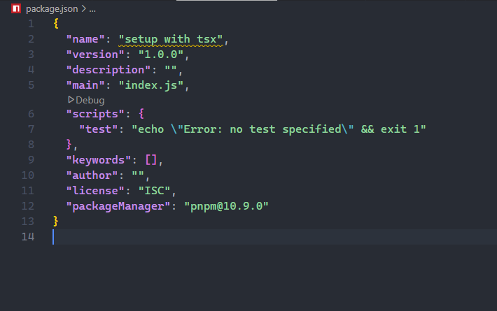
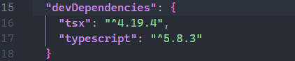

# **Setting Typescript with tsx**

step1

Initiallize package.json file

`pnpm init`

Output of the Json file



step 2

Install tsx and typescript as Dev dependancies

`pnpm install -D tsc typescript`

The following will be generated in package.json file



step 3

Create tsconsfig.json file- This file configures how your typescript code should be executed

`pnpm tsc --init`

step 4

Add the following code to the created tsconfig.json file

```
{
  "compilerOptions": {
    "target": "ES2022",
    "module": "NodeNext",
    "rootDir": "./src",
    // "moduleResolution": "node10",
    "moduleResolution": "nodenext",
    "outDir": "./dist",
    "esModuleInterop": true,
    "forceConsistentCasingInFileNames": true, 
    /* Type Checking */
    "strict": true,
    "skipLibCheck": true 
  },
  "include": [
    "src/**/*"   
  ],
  "exclude": [
    "node_modules",
    "**/*.spec.ts"
  ],
}

```


step 5

Create ***src*  **folder at the root of the project and add ***index.ts*** file

```
export const sum = (a: number, b: number): number => {
    return a + b;
}

console.log(sum(2+4))


```

step 6

Setting up scripts on package.json file

```
"scripts": {
    "dev": "tsx watch src/index.ts",
    "build": "tsc",
    "start": "npm run build && node dist/index.js"
  },
```

step 7

Run your code/ build

- to run on development

`pnpm run dev`

to run on production

`npm run build && node dist/index.js`

to build the code

`pnpm run build`
